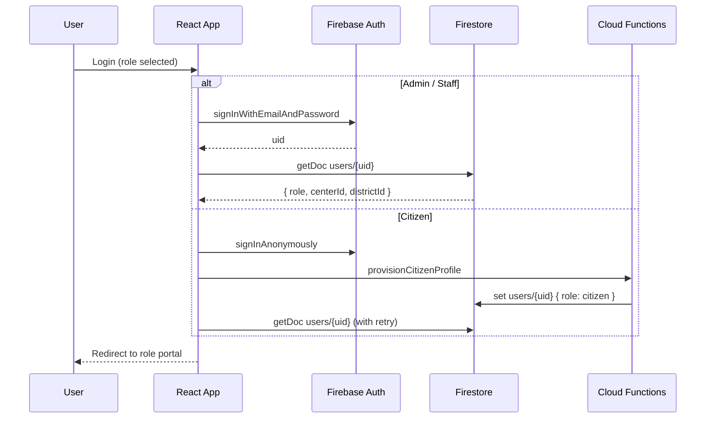
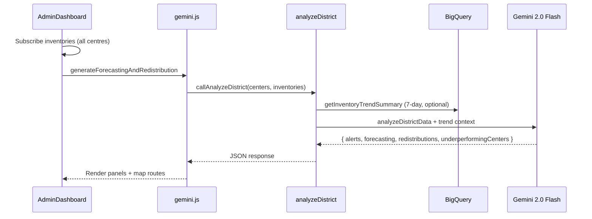
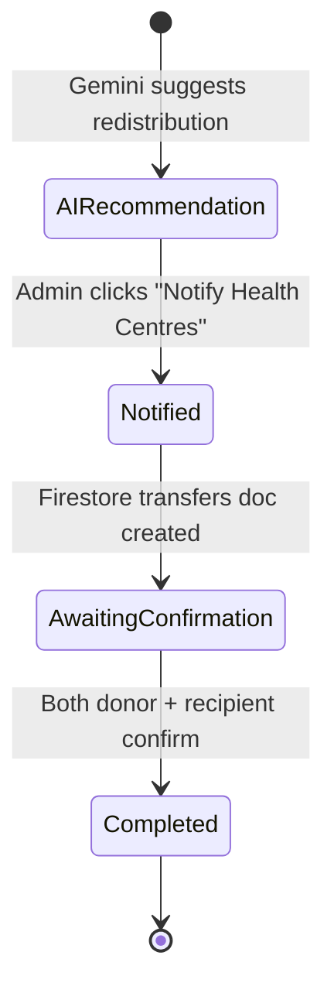

# Chikitsalay Setu — Architecture

AI-driven PHC/CHC health center management for the **Build with AI: Code for Communities** hackathon (Track 3: Smart Health).

**Live deployment**: [chikitsalaysetu.web.app](https://chikitsalaysetu.web.app)  
**Firebase project**: `chikitsalaysetu` (region: `asia-south1`)

For setup, environment variables, and deployment steps, see [`README.md`](README.md).

---

## 1. System overview

Chikitsalay Setu is a single-page React application backed by Firebase. Operational data flows through Firestore in real time; AI, speech, translation, and analytics run in Cloud Functions so API keys never reach the browser.

```
┌─────────────────────────────────────────────────────────────────────────┐
│                     React SPA (Firebase Hosting)                        │
│  HomePage │ AdminDashboard │ PHCPortal │ CitizenPortal │ VoiceAssistant │
└──────┬──────────────┬──────────────────────┬────────────────────────┘
       │              │                          │
       ▼              ▼                          ▼
┌──────────────┐ ┌──────────────┐        ┌──────────────────┐
│ Firebase Auth│ │  Firestore   │        │ Cloud Functions  │
│ email + anon │ │  realtime    │        │   asia-south1    │
└──────────────┘ └──────────────┘        └────────┬─────────┘
                                                  │
                    ┌─────────────────────────────┼─────────────────────────┐
                    ▼                             ▼                         ▼
              Gemini 2.0 Flash          Speech-to-Text              Translation API
                    │                             │                         │
                    └─────────────────────────────┼─────────────────────────┘
                                                  ▼
                                           BigQuery (health_ops)
```

### Design principles

| Principle | Implementation |
|-----------|----------------|
| **Server-side AI** | Gemini key stored as Functions secret (`GEMINI_API_KEY`) |
| **Realtime ops** | Firestore `onSnapshot` listeners for centres, inventory, transfers, feedback |
| **Graceful degradation** | localStorage + client-side simulation when Firebase is not configured |
| **Role isolation** | Firestore security rules + scoped queries (staff read own centre only) |
| **Auditability** | `updatedAt`, `source` (`portal` \| `voice` \| `admin`) on operational writes |
| **Cost control** | Rate limiting (15 calls/min/user), translation batching, scheduled BQ sync |

---

## 2. Application layers

### 2.1 Frontend components

| Component | Role access | Responsibility |
|-----------|-------------|----------------|
| `HomePage` | Public | Landing page, language selector, role-based login entry |
| `LoginModal` | Public | Email/password (admin, staff) or anonymous citizen sign-in |
| `AdminDashboard` | Admin | District KPIs, AI audit, map, transfers, feedback analytics, BQ sync |
| `PHCPortal` | Health centre | Centre status/inventory updates, transfer confirmations |
| `VoiceAssistant` | Health centre | Audio capture → Speech-to-Text → Gemini parsing → Firestore write |
| `CitizenPortal` | Citizen | Centre search, directions, ratings, **text/voice feedback**, scheme info |
| `InteractiveMap` / `CanvasMap` | Admin | Geospatial centre map with redistribution routes |
| `DevToolsModal` | Dev only | Seed, reset, test Functions/translation (`import.meta.env.DEV`) |

### 2.2 Service modules (`src/services/`)

| Module | Purpose |
|--------|---------|
| `firebaseApp.js` | Firebase SDK init, emulator wiring, App Check (production), config from `.env` or localStorage |
| `firebase.js` | Firestore CRUD + realtime subscriptions; dual-mode localStorage mirror/fallback |
| `auth.js` | Sign-in/out, profile hydration, `provisionCitizenProfile` call, mock auth for offline mode |
| `api.js` | Thin `httpsCallable` wrappers for all Cloud Functions |
| `gemini.js` | Client-side AI orchestration with Cloud Function fallback → local simulation |
| `translation.js` | UI string translation with in-memory + localStorage cache and batch chunking (80 strings) |

### 2.3 Cloud Functions (`functions/`)

| Function | Trigger | Auth | Purpose |
|----------|---------|------|---------|
| `analyzeDistrict` | `onCall` | Required | Gemini district audit: alerts, forecasting, redistributions, underperforming centres |
| `parseVoiceReport` | `onCall` | Required | Gemini structured parsing of voice transcripts |
| `transcribeAudio` | `onCall` | Required | Speech-to-Text (hi/kn/te/ta/en-IN) |
| `translateTextFn` | `onCall` | Required | Single or batch translation (batch exempt from per-string rate limit) |
| `getLanguages` | `onCall` | Required | Returns supported translation language codes |
| `syncToBigQuery` | `onCall` | Admin only | On-demand Firestore → BigQuery snapshot |
| `scheduledBigQuerySync` | `onSchedule` (24h) | N/A | Automated daily BigQuery sync |
| `seedDemoAccounts` | `onCall` | Open* | Creates demo users + seeds centres/inventory/feedback |
| `provisionCitizenProfile` | `onCall` | Required | Writes `users/{uid}` with `role: citizen` for anonymous sessions |

\* `seedDemoAccounts` requires `{ confirmSeed: true }` in production; emulator skips this guard.

---

## 3. Dual-mode operation

The app runs in one of two modes, determined at init by `firebaseApp.js`:

### 3.1 Live mode (`isFirebaseLive() === true`)

- Triggered when `VITE_FIREBASE_*` env vars (or saved localStorage config) initialise Firebase successfully.
- All reads/writes go to Firestore; localStorage is used as a **read mirror** for resilience (inventory, feedback, transfers cached locally on snapshot).
- AI, speech, and translation call Cloud Functions in `asia-south1`.
- App Check (reCAPTCHA v3) initialised in production when `VITE_RECAPTCHA_SITE_KEY` is set.

### 3.2 Offline demo mode

- Triggered when Firebase config is missing or init fails.
- All data stored in localStorage keys: `smart_health_centers`, `smart_health_inventory`, `smart_health_feedback`, `smart_health_transfers`.
- Auth uses in-memory mock users (`auth.js`).
- AI uses client-side `getSimulatedInsights()` with artificial delay (`gemini.js`).
- Voice presets work; live microphone transcription requires Cloud Functions **and** a browser secure context (HTTPS or `localhost`).
- Citizen feedback also includes **simulated voice feedback samples** so the UX remains demoable without mic/STT.

```
                    ┌─────────────────┐
                    │  App bootstrap  │
                    └────────┬────────┘
                             │
              ┌──────────────┴──────────────┐
              ▼                             ▼
     VITE_FIREBASE_* present          Config missing / failed
              │                             │
              ▼                             ▼
        Live Firebase                  Offline demo
     Firestore + Functions          localStorage + mock AI
```

---

## 4. Authentication & authorization

### 4.1 Roles

| Role | Auth method | Profile source | `centerId` |
|------|-------------|----------------|------------|
| `admin` | Email/password | `users/{uid}` | — |
| `healthcenter` | Email/password | `users/{uid}` | Required (scopes all access) |
| `citizen` | Anonymous (or existing anon session) | `provisionCitizenProfile` | — |

### 4.2 Auth flow



**Citizen profile race handling**: `provisionCitizenProfile` writes asynchronously; `auth.js` retries profile fetch (0 → 150 → 300 → 600 → 1200 ms) to avoid a stuck `role: null` state.

**Anonymous auth for translation**: Homepage translation may create an anonymous session before citizen login. `signInCitizen()` reuses that session and calls `provisionCitizenProfile`.

**Callable auth for translation**: `ensureCallableAuth()` signs in anonymously if no user exists, so unauthenticated homepage visitors can call `translateTextFn`.

### 4.3 Session → data scoping

- `App.jsx` re-subscribes to `subscribeToCenters` whenever auth changes (prevents stale localStorage state after logout).
- Health centre staff: `subscribeToCenters` reads a **single document** (`centers/{centerId}`) because collection queries are denied by security rules.
- Admin/citizen: full `centers` collection query.

---

## 5. Core workflows

### 5.1 District AI audit (Admin)



- **Auto-run**: AdminDashboard triggers audit once when all centre inventories are loaded (`hasAutoRunAudit` ref).
- **Fallback**: If Functions or Gemini fail, server and client both fall back to `getSimulatedInsights()`.
- **BigQuery enrichment**: `analyzeDistrict` optionally includes 7-day inventory trend aggregates from `health_ops.inventory_daily`.

### 5.2 Supply transfer workflow



1. **AI recommendation** — displayed in AdminDashboard transfers panel (not yet persisted).
2. **Notify** — `notifyHealthCentersForTransfer()` creates `transfers/{id}` with `status: notified`, `donorConfirmed: false`, `recipientConfirmed: false`.
3. **Staff confirmation** — PHCPortal shows transfers where `fromId` or `toId` matches staff `centerId`. `confirmTransferCompletion()` sets the appropriate flag.
4. **Completion** — when both flags are true, status becomes `completed` with `completedAt` timestamp.
5. **Admin tracking** — AdminDashboard subscribes to all transfers; shows pending (notified) and completed sections.

### 5.3 Voice reporting (Health centre)

1. Staff records audio via `MediaRecorder` (WebM/Opus).
2. Audio converted to base64 → `transcribeAudio` Cloud Function → Speech-to-Text.
3. Transcript → `parseVoiceReport` → Gemini extracts `{ operation, itemName, quantity, confidence }`.
4. On apply: `updateInventoryItem` or `updateCenterDetails` with `source: 'voice'`.
5. Inventory updates trigger `evaluateCenterInventoryStatus()` which may elevate centre `status` to `warning` or `critical`.

**Preset transcripts** (Hindi, Kannada, Telugu, Hinglish) available when microphone or Speech-to-Text is unavailable.

### 5.4 Multilingual citizen experience

| Layer | Mechanism |
|-------|-----------|
| Language selection | `LANGUAGE_OPTIONS`: en, hi, kn, te, ta — persisted in `chikitsalay_preferred_language` |
| Homepage | `translateHomePageContent()` batch-translates UI strings |
| Citizen portal | `translateCitizenPortalContent()` batch-translates portal + scheme strings |
| Caching | In-memory Map + localStorage (`chikitsalay_translation_cache`, versioned) |
| API | `translateTextFn` supports single text or batch (max 80 strings); batch calls skip per-string rate limiting |

### 5.5 Analytics sync (BigQuery)

| Trigger | Function | Access |
|---------|----------|--------|
| Admin button | `syncToBigQuery` | Admin role verified server-side |
| Scheduled | `scheduledBigQuerySync` | Every 24 hours |

Sync reads all `centers`, subcollections `inventory` and `feedback`, inserts rows into `health_ops` dataset (auto-creates dataset/tables in `asia-south1`).

---

## 6. Data model

### 6.1 Firestore collections

```
users/{uid}
centers/{centerId}
centers/{centerId}/inventory/{itemId}
centers/{centerId}/feedback/{feedbackId}
transfers/{transferId}
```

#### `users/{uid}`

| Field | Type | Notes |
|-------|------|-------|
| `role` | string | `admin` \| `healthcenter` \| `citizen` |
| `email` | string? | Null for anonymous citizens |
| `centerId` | string? | Required for `healthcenter` |
| `districtId` | string? | e.g. `DHARWAD-01` |
| `displayName` | string? | |
| `isAnonymous` | boolean? | Set by `provisionCitizenProfile` |
| `createdAt` | ISO string | |

> Client writes to `users/{uid}` are **denied** by security rules. Profiles are created by `seedDemoAccounts` and `provisionCitizenProfile`.

#### `centers/{centerId}`

| Field | Type | Notes |
|-------|------|-------|
| `name`, `type`, `location` | string | PHC/CHC metadata |
| `coordinates` | `{ lat, lng }` | Map markers |
| `status` | string | `normal` \| `warning` \| `critical` — auto-computed on updates |
| `beds` | `{ total, occupied }` | |
| `doctors` | `{ total, present }` | |
| `footfall` | `{ today, averageDaily }` | |
| `diagnosticTests` | map | boolean flags per test type |
| `lastUpdated`, `updatedAt` | ISO string | Audit |
| `source` | string | `portal` \| `voice` \| `admin` |

#### `centers/{centerId}/inventory/{itemId}`

Document ID: sanitised item name (`item.name.replace(/[^a-zA-Z0-9]/g, '_')`).

| Field | Type | Notes |
|-------|------|-------|
| `name`, `category` | string | |
| `stock`, `minRequired`, `dailyUsage` | number | Used for forecasting + status |
| `updatedAt`, `source` | | Audit |

#### `centers/{centerId}/feedback/{feedbackId}`

| Field | Type | Notes |
|-------|------|-------|
| `rating` | number | 1–5 |
| `categories` | string[] | e.g. Cleanliness, Staff Behavior |
| `comment` | string | |
| `name` | string? | Optional; anonymous if omitted |
| `timestamp` | ISO string | Ordered desc in queries |

#### `transfers/{transferId}`

| Field | Type | Notes |
|-------|------|-------|
| `itemName`, `fromId`, `fromName`, `toId`, `toName` | string | |
| `quantity` | number | |
| `urgency` | string | `High` \| `Medium` |
| `distanceEstimate`, `reason` | string | From AI recommendation |
| `status` | string | `notified` \| `completed` |
| `donorConfirmed`, `recipientConfirmed` | boolean | |
| `notifiedAt`, `createdAt`, `completedAt` | ISO string | |
| `source` | string | `admin` |

### 6.2 Firestore indexes

Defined in `firestore.indexes.json` for centre-scoped transfer queries:

- `transfers`: `fromId ASC, createdAt DESC`
- `transfers`: `toId ASC, createdAt DESC`

### 6.3 BigQuery tables (`health_ops` dataset)

| Table | Key columns | Purpose |
|-------|-------------|---------|
| `centers_daily` | `center_id`, beds, doctors, footfall, `status`, `synced_at` | Daily centre snapshots |
| `inventory_daily` | `center_id`, `item_name`, `stock`, `min_required`, `daily_usage`, `synced_at` | Inventory trends |
| `feedback` | `center_id`, `rating`, `category`, `comment`, `timestamp`, `synced_at` | Citizen feedback analytics |

`getInventoryTrendSummary()` queries `inventory_daily` for 7-day aggregates, fed into Gemini district analysis.

### 6.4 Demo data

Five Dharwad district centres seeded from `src/utils/mockData.js`:

- PHC Narendra, PHC Hebballi, PHC Mugad
- CHC Kalghatgi, CHC Kundgol

Demo users created by `seedDemoAccounts` (see README for credentials).

---

## 7. Security model

### 7.1 Firestore rules (`firestore.rules`)

| Collection | Admin | Health centre staff | Citizen |
|------------|-------|---------------------|---------|
| `users/{uid}` | Read own | Read own | Read own |
| `users/{uid}` write | **Denied** | **Denied** | **Denied** |
| `centers` read | All | Own centre only | All |
| `centers` write | All | Own centre only | **Denied** |
| `inventory` read | All | Own centre | All |
| `inventory` write | All | Own centre | **Denied** |
| `feedback` read | All | Own centre | **Denied** |
| `feedback` create | Yes | **Denied** | Yes |
| `transfers` read | All | Related (`fromId` or `toId`) | **Denied** |
| `transfers` create | Yes | **Denied** | **Denied** |
| `transfers` update | Yes | Related (confirm) | **Denied** |

Role is resolved via `get(/users/{uid})` on every request — users cannot self-assign roles.

### 7.2 Cloud Functions security

- All callable functions require `request.auth` except `seedDemoAccounts` (guarded by `confirmSeed` in production).
- `syncToBigQuery` verifies `users/{uid}.role === 'admin'` server-side.
- **Rate limiting**: in-memory map, 15 requests per UID per 60-second window (`resource-exhausted` on exceed).
- **Secrets**: `GEMINI_API_KEY` via `defineSecret`, injected per-invocation in `withGeminiKey`.

### 7.3 Client security

- Firebase web API key is public by design; protection comes from rules + App Check.
- Maps API key should be HTTP-referrer restricted in GCP Console.
- Dev tools (seed, reset, BQ sync test) render only when `import.meta.env.DEV`.

---

## 8. Google Cloud services

| Service | Usage |
|---------|-------|
| **Firebase Auth** | Email/password (admin, staff) + anonymous (citizens, translation) |
| **Cloud Firestore** | Real-time operational datastore |
| **Cloud Functions v2** | Server-side AI, speech, translation, analytics (Node 20, ESM) |
| **Gemini API** | `gemini-2.0-flash` — district audit, voice parsing, intervention briefs |
| **Cloud Speech-to-Text** | Multilingual audio transcription (hi/kn/te/ta/en-IN) |
| **Cloud Translation API** | Homepage + citizen portal UI translation |
| **BigQuery** | Daily snapshots, 7-day inventory trend queries |
| **Google Maps Platform** | Centre map, directions (CitizenPortal) |
| **Firebase Hosting** | SPA with `** → /index.html` rewrite |
| **Firebase App Check** | reCAPTCHA v3 in production |

---

## 9. Centre status computation

Status is derived automatically on writes (not manually set by staff):

**On centre detail update** (`updateCenterDetails`):
- `critical` — no doctors present, or overcrowded + no doctors
- `warning` — occupancy ≥ 80%, or only 1 doctor present
- `normal` — otherwise

**On inventory update** (`evaluateCenterInventoryStatus`):
- `critical` — any item at stock 0
- `warning` — more than one item below `minRequired`
- Combined with doctor attendance in local/offline mode

---

## 10. Deployment & CI/CD

### 10.1 Manual deploy

See [`README.md`](README.md) for full commands. Summary:

1. `firebase deploy --only functions,firestore:rules`
2. `seedDemoAccounts({ confirmSeed: true })`
3. `npm run build && firebase deploy --only hosting`

### 10.2 GitHub Actions

`.github/workflows/firebase-deploy.yml` runs on push to `main`/`master`:

1. `npm ci` → `npm run build` (with `VITE_*` GitHub secrets)
2. `npm ci` in `functions/`
3. Deploy via `FirebaseExtended/action-hosting-deploy` (live channel)

> Note: The workflow deploys Hosting. Functions and Firestore rules require separate deploy steps.

---

## 11. Local development

```bash
# Terminal 1
firebase emulators:start

# Terminal 2
VITE_USE_FIREBASE_EMULATORS=true npm run dev
```

Emulator ports (from `firebase.json`): Auth `9099`, Functions `5001`, Firestore `8080`, Hosting `5000`.

Without Firebase configured, the app runs entirely in offline demo mode (no emulators needed).

---

## 12. Cost controls

The stack targets GCP/Firebase free tiers for a single-district pilot:

- Set **$1 and $5 budget alerts** in GCP Console immediately after enabling Blaze billing.
- Gemini proxied server-side (AI Studio free tier for demos).
- Rate limiting prevents runaway Function invocations.
- Translation batching reduces API calls; results cached in localStorage.
- BigQuery sync is daily (scheduled) plus optional on-demand admin trigger.
- Restrict Maps API keys by HTTP referrer.

---

## 13. Scaling beyond pilot

| Scenario | Approach |
|----------|----------|
| **50+ PHCs** | Firestore handles real-time ops; BigQuery handles batch analytics and trend forecasting |
| **Multi-district** | Clone Firebase project per district; shared BigQuery dataset with `district_id` column |
| **Low connectivity** | Voice presets + offline localStorage cache; Firestore syncs when connectivity returns |
| **Higher AI load** | Increase `maxInstances` on Functions; add Cloud Tasks queue for batch audits |
| **Feedback at scale** | Paginate feedback queries; aggregate in BigQuery rather than client-side |

---

## 14. Key file reference

```
src/
├── App.jsx                    # Routing, auth gating, dev tools
├── components/                # UI portals
├── services/
│   ├── firebaseApp.js         # SDK init, emulators, App Check
│   ├── firebase.js            # Firestore + localStorage dual mode
│   ├── auth.js                # Authentication flows
│   ├── api.js                 # Cloud Function callables
│   ├── gemini.js              # Client AI orchestration + fallback
│   └── translation.js         # Translation cache + batching
├── constants/languages.js     # Supported UI languages
└── utils/mockData.js          # Demo centres, inventory, feedback

functions/
├── index.js                   # Callable + scheduled function exports
├── ai.js                      # Gemini prompts + simulation fallback
├── speech.js                  # Speech-to-Text
├── translation.js             # Cloud Translation
├── bigquery.js                # Sync + trend queries
└── seed.js                    # Demo user/data seeding

firestore.rules                # Role-based access control
firestore.indexes.json         # Composite indexes for transfers
firebase.json                  # Hosting, emulators, functions config
```
